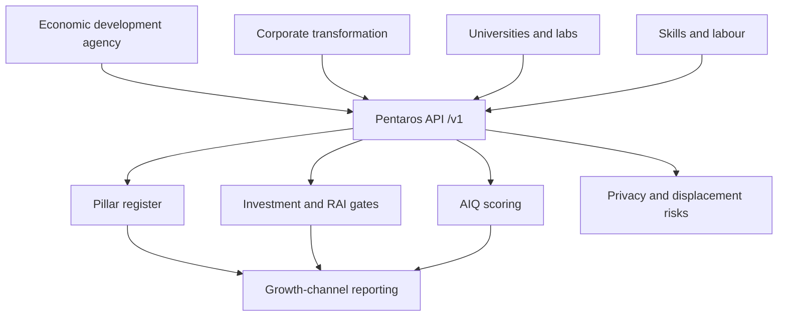

# Pentaros

**Source:** `ai-in-gov/Accenture-AI-South-Africa-Ready/`
**Domain:** `ai-gov`
**One-liner:** Pentaros is a five-pillar AI ecosystem readiness and investment-gating system that forces South African (and peer emerging-market) AI programmes to score universities, startups, large companies, policymakers, and multi-stakeholder partnerships — and refuses growth claims that lack workforce reskilling and inclusive-growth commitments.
**Wedge:** National economic development agencies and large-enterprise transformation offices in South Africa that have executive enthusiasm for AI (78% say they must invest) but only about a third planning significant spend in three years — starting with a single sector wedge such as financial services or agriculture drones where local startups already exist.
**Positioning:** An ecosystem orchestration OS for “Is South Africa ready?” The Accenture–GIBS report argues AI can add up to a full percentage point to annual growth by 2035 and that collaborative inventors capture roughly 90% more firm value — yet structural education, infrastructure, trust, and collaboration gaps block the path. Pentaros turns the five-pillar ecosystem model and responsible-AI / reskilling duties into an operable programme ledger, not a one-off readiness PDF.

## Market research synthesis

### Thesis from source

The report asks whether South Africa — population over 55 million, sluggish digital adoption, legacy systems, and workforce anxiety about job loss and inequality — will be left out of the AI transformation. Globally it cites an AI market over $35 billion by 2025 and the potential to double annual economic growth rates. Domestically, 78% of South African executives say they must boost competitiveness through AI (notably embedded AI and computer vision), yet only about a third plan significant AI investment over the next three years. A July 2017 Accenture–GIBS roundtable named blockers: data quality and privacy, workforce readiness and reskilling, potential job losses, weak C-suite data-science competency, education quality from primary through university, weak national innovation ecosystems, poor enabling infrastructure, low trust, and weak collaborative mindsets.

Accenture’s economic model channels value through intelligent automation, labour/capital augmentation, and innovation diffusion, concluding AI could add up to one percentage point to South Africa’s annual growth by 2035 and allow the economy to double in size five years earlier. The prescribed path has three thrusts. First, create a vibrant ecosystem on five pillars — universities, startups, large companies, policymakers, and multi-stakeholder partnerships — with DFKI-style public–private research partnerships held up as a blueprint and Chinese provincial subsidies ($800k–$1M) as a contrasting public-led model. Local startup signals include Data Prophet, Clevva, Aerobotics, and Stockshop. Second, turn AI investment into ai-driven growth via Artificial Intelligence Quotient (AIQ): firms that move from “observer” to “collaborative inventor” could see firm value rise ~90% on average; fewer than 20% of analysed companies are strong on both invention and collaboration (14% collaborative inventors). Third, practice responsible AI: prepare stakeholders for intellectual, political, ethical and social questions; train people to work with machines; identify groups at disproportionate displacement risk; and craft accountability rules for self-learning systems.

The product implication is not a generic “national AI dashboard.” It is a gated programme system: ecosystem pillar health, AIQ movement for anchor firms, and mandatory reskill / inclusive-growth conditions on public support and corporate investment cases.

### Buyer & economic model

- Primary buyer: head of digital economy or innovation in a national or provincial economic development agency; co-buyer is the chief transformation / digital officer at a JSE-listed incumbent running an AI investment portfolio.
- Users: ecosystem programme managers; university and science-council liaison officers; startup agency portfolio managers; corporate AI programme leads; labour and skills officials tracking at-risk occupations; ethics / responsible-AI officers.
- Budget owner / value metric: innovation and skills programme budgets justified against the +1pp growth narrative and avoided stranded AI pilots. Value metric is share of funded initiatives with live pillar partnerships and completed reskill plans, plus movement of anchor firms from observer toward collaborative inventor.
- Competing status quo: one-off consultant readiness reports; disconnected SETA skills plans; corporate AI pilots with no workforce transition budget; announcements of “AI strategies” without pillar owners or multi-stakeholder partnership instruments.

### Domain constraints

- Regulatory / trust / safety: data privacy regulation was flagged as urgent by roundtable attendees; responsible-AI accountability for errors in medical or autonomous systems; inclusive growth is a political constraint — programmes that appear to worsen inequality will be blocked.
- Data sensitivity: labour displacement maps and firm-level AIQ assessments are politically and commercially sensitive; public extracts must aggregate; firm AIQ details stay bilateral between the firm and the programme office.
- Change-management realities: low trust and weak collaboration cultures mean the tool must create value from the first registered partnership, not after a perfect five-pillar score; education-system fixes are multi-year, so the ledger must track leading inputs (fellowships, SETA modules) separately from lagging outcomes (graduate AI supply).

## Business requirements

- BR-1: Every national or sector AI programme registers owners against all five pillars — universities, startups, large companies, policymakers, multi-stakeholder partnerships — and reports incomplete pillar coverage as a headline blocker.
- BR-2: Public co-funding or agency endorsement of a corporate AI investment case requires a recorded workforce reskilling commitment with target roles, budget, and timeline; cases without it cannot move past the gate.
- BR-3: Programmes must name occupation groups at elevated displacement risk and attach a reintegration strategy before scaling automation claims in that sector.
- BR-4: Anchor firms on the programme receive an AIQ position — observer, collaborator, inventor, or collaborative inventor — revisited on a fixed cycle with evidence of in-house invention versus external collaboration.
- BR-5: Ecosystem health scores must separate infrastructure and education leading indicators from firm-value and growth lagging indicators, and must not publish a single composite that hides pillar failure.
- BR-6: Multi-stakeholder partnerships require a written instrument (MoU, joint lab, shared compute access) with review dates; “announced collaboration” without an instrument does not count toward pillar health.
- BR-7: Startup portfolio tracking must record sector and capability (for example finance ML, drone agriculture) so the agency can see whether the ecosystem is diversifying or concentrating.
- BR-8: Privacy and data-quality readiness are first-class programme risks with owners and due dates, reflecting the roundtable’s insistence that privacy regulation come sooner rather than later.
- BR-9: Responsible-AI questions — accountability for model error, ethics codes for self-learning systems — must be attached to high-impact deployments before go-live endorsement.
- BR-10: Progress toward the +1pp growth narrative is reported only through the three value channels (automation, augmentation, diffusion) with stated assumptions, not as an unallocated headline.
- BR-11: Inclusive-growth impact statements are mandatory on programme reviews; adverse distributional findings create a remediation task rather than a buried footnote.
- BR-12: Provincial or metro programmes can inherit the national pillar framework with local owners, so readiness is composable rather than Pretoria-only.

## User stories

Canonical user stories live in sibling [USER_STORIES.md](USER_STORIES.md).

## System design

### Overview

Pentaros runs AI readiness as a managed programme. A jurisdiction or sector programme instantiates the five pillars, registers initiatives and partnership instruments, gates corporate investment cases on reskill and inclusive-growth commitments, scores anchor-firm AIQ, and tracks responsible-AI and privacy risks. Public views show pillar health and channelled growth assumptions; bilateral firm views show AIQ evidence.

### Actors & boundaries

- Actors: programme directors; corporate transformation leads; university and startup liaisons; skills officials; responsible-AI and privacy officers; provincial programme managers.
- Trust boundary: firm AIQ and displacement maps are sensitive; public extracts are aggregated. Pentaros does not run models in production — it gates and records the organisational conditions for AI programmes.
- Human-in-the-loop points: pillar ownership assignment; investment-case gate decisions; AIQ position judgements; responsible-AI go-live endorsement; inclusive-growth remediation acceptance.

### Core capabilities

1. **Programme and pillar register** — jurisdiction/sector programmes with five-pillar ownership and health.
2. **Partnership instruments** — MoUs, joint labs, shared resources with review cycles.
3. **Investment-case gating** — reskill commitments and inclusive-growth statements as pass/fail gates.
4. **Displacement risk mapping** — at-risk groups and reintegration strategies.
5. **AIQ scoring** — observer through collaborative inventor with evidence and revisit cycles.
6. **Startup and research portfolio** — local AI venture and lab tracking by capability.
7. **Privacy and data-quality risk register** — owners, due dates, escalations.
8. **Responsible-AI deployment gates** — accountability assignment before endorsement.
9. **Growth-channel reporting** — automation, augmentation, diffusion with assumptions.
10. **Multi-level composability** — national and provincial programme inheritance.

### Conceptual data

- Primary entities: JurisdictionProgramme, Pillar, PillarOwner, PartnershipInstrument, InvestmentCase, ReskillCommitment, InclusiveGrowthStatement, DisplacementRiskGroup, ReintegrationStrategy, FirmAiqProfile, StartupPortfolioEntry, PrivacyRisk, ResponsibleAiGate, GrowthChannelAssumption, ProgrammeReview.
- Critical events: programme opened; pillar owner assigned; instrument signed/reviewed; investment case gated pass/fail; AIQ rescored; displacement group tagged; responsible-AI gate passed/blocked; review published.
- Retention / audit needs: gate decisions and AIQ history retained for programme life plus audit cycle; public extracts versioned; firm-confidential profiles access-logged.

### Integrations (conceptual)

- Systems of record: economic development grant systems; SETA / skills funding; corporate HR learning systems; university research admin; startup agency CRMs; privacy regulator correspondence logs.
- Upstream signals: Accenture-style technology vision indicators; local startup directories; education and infrastructure statistics; labour force surveys for occupation risk.
- Downstream actions: grant disbursement holds; public readiness scorecards; board investment papers; SETA curriculum commissions; partnership renewals.

### High-level architecture

### Success metrics

- Leading: pillar ownership completeness; share of investment cases passing reskill gates on first submission; partnership instruments with on-time reviews; AIQ revisit completion rate.
- Lagging: movement of anchor firms into collaborative-inventor band; reduction in stranded pilots; measured reskill completion for tagged at-risk groups; credible contribution evidence toward the +1pp path by value channel.

## OpenAPI skeleton

Canonical HTTP surface lives in sibling [openapi.yaml](openapi.yaml). Summary:

- **Base path:** `/v1/...`
- **Auth:** `X-API-Key` for agency and HRIS connectors; Bearer JWT for programme operators.
- **Resource groups:** Programmes, Pillars, Partnerships, InvestmentCases, AiqProfiles, Risks, Reporting.
