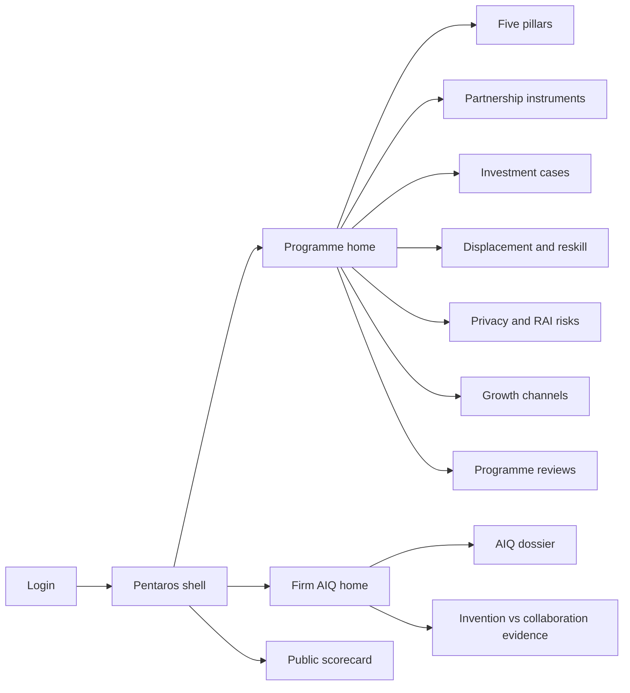
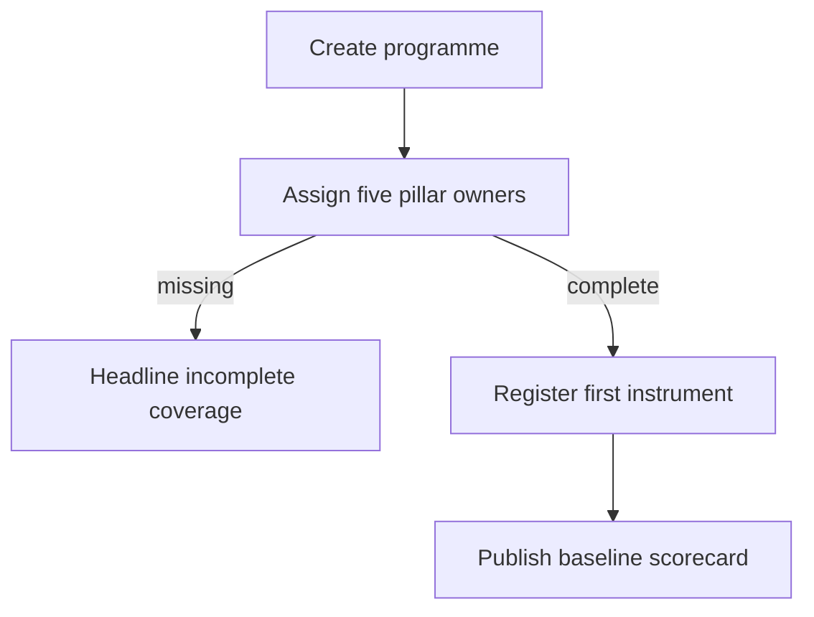
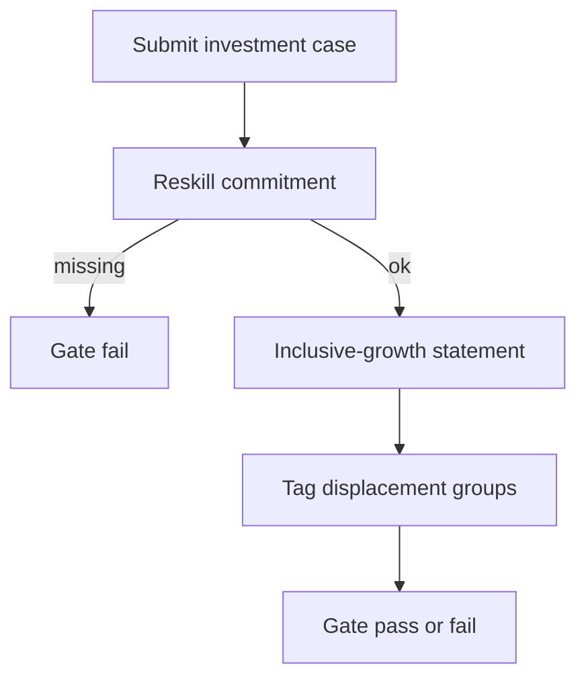

# Pentaros — Web app

**Product:** [PRODUCT.md](./PRODUCT.md)
**Primary surface:** National / provincial AI programme ledger (economic development + corporate transformation operators)
**Secondary surfaces:** Public pillar health scorecard (aggregated, read-only); firm-bilateral AIQ dossier (restricted)
**Design thesis:** Pentaros is a five-pillar gatehouse, not a glossy “South Africa is ai-ready” poster. The UI metaphor is a programme ledger with five accountable columns — universities, startups, large companies, policymakers, partnerships — where incomplete ownership and missing reskill commitments block progress the way a customs stamp blocks cargo. Visual language is Highveld dusk: deep indigo-earth ground, sun-baked clay accents, and veld-gold for cleared gates; growth claims only appear when split into automation, augmentation, and diffusion channels with assumptions visible. The Pentaros wordmark sits as a quiet mint-of-authority on every gate decision so funders know whose readiness claim they are endorsing.

## UX research synthesis

### Category peers (best-in-class)

- **OECD.AI Policy Observatory:** Country policy inventories with filterable instruments and evidence links rather than a single composite score. Steal: pillar/instrument drill-downs that refuse to hide a failing dimension behind a green national badge.
- **Stanford HAI AI Index:** Leading vs lagging indicator separation and transparent methodology footnotes on every chart. Steal: explicit channel assumptions and “do not conflate inputs with outcomes” chrome.
- **World Bank GovTech Maturity Index:** Multi-pillar maturity with clear ownership of each dimension and comparable jurisdiction slices. Steal: composable national → provincial inheritance without Pretoria-only lock-in.
- **Singapore IMDA AI Verify / AI Governance Testing Framework:** Gate-before-deploy checklists with accountability assignment. Steal: responsible-AI and privacy gates as blocking states, not optional ethics PDFs.

### Patterns to adopt / reject

- **Adopt:** Five-pillar coverage as the headline blocker; investment-case gate with reskill + inclusive-growth pass/fail; AIQ ladder (observer → collaborative inventor) with evidence packets; partnership instruments with review dates (MoU theatre does not count); leading education/infrastructure indicators separated from lagging firm-value outcomes; role-gated firm AIQ vs public aggregates.
- **Reject:** Single composite “readiness %” that masks pillar failure; unallocated +1pp growth banners; editable gate history; purple “AI insights” sidebars; chatbots as the primary programme builder; vanity startup logos without sector/capability tags.

### Trust, density, and workflow constraints from PRODUCT.md

Operators need programme-grade density without leaking firm AIQ or occupation-level displacement maps publicly (BR-5, admin stories): public extracts aggregate; bilateral firm views are access-logged. Inclusive-growth adverse findings must create remediation tasks, not footnotes (BR-11). Low-trust collaboration cultures require value from the first registered instrument (BR-6), so empty states push “sign first MoU / assign first pillar owner,” not “complete a perfect score.” Privacy and data-quality risks are first-class with owners and due dates (BR-8); high-impact deployments stay blocked until model-error accountability is assigned (BR-9).

## Information architecture

### Nav model

### Roles → default home

| Role | Default home | Why |
|------|--------------|-----|
| Economic development programme director | Programme home — pillar coverage blockers | Daily accountability (BR-1) |
| Corporate transformation lead | Firm AIQ home | Move toward collaborative inventor (BR-4) |
| Skills / labour official | Displacement and reskill | Aim SETA reintegration (BR-3) |
| University / science-council liaison | Partnership instruments + university pillar | Count only funded/staffed labs (BR-6) |
| Startup agency portfolio manager | Startup portfolio under pillars | Diversification vs concentration (BR-7) |
| Responsible-AI / privacy officer | Privacy and RAI risks | Block endorsement without accountability (BR-8, BR-9) |
| Provincial / metro programme manager | Inherited programme home | Composable readiness (BR-12) |

### Cross-links to OpenAPI resources

| Nav area | OpenAPI tags / resources |
|----------|---------------------------|
| Programmes | Programmes |
| Five pillars | Pillars |
| Partnership instruments | Partnerships |
| Investment cases / gates | InvestmentCases |
| Firm AIQ | AiqProfiles |
| Privacy, displacement, RAI | Risks |
| Growth-channel reports | Reporting |

## Screen inventory

### Programme home

- **Purpose:** Answer “which pillars lack owners, and which investment cases are blocked?” in one composition.
- **Entry:** Post-login for agency roles; deep link from review alerts.
- **Layout regions:** Brand + jurisdiction/sector switcher; five-pillar coverage strip (owner named / missing as headline blocker); gate queue (reskill/inclusive-growth fails); open partnership review dates; privacy/RAI escalations rail; growth-channel summary with assumption footnotes.
- **Primary actions:** Assign pillar owner; open blocked investment case; schedule partnership review; publish programme review draft.
- **Empty / loading / error:** Empty = create first JurisdictionProgramme + assign five owners; loading = skeleton pillars; error = retry with request id.
- **BR / story ties:** BR-1, BR-5, BR-10; programme director stories.

### Five pillars register

- **Purpose:** Make “vibrant ecosystem” an accountable list with named owners and health per pillar.
- **Entry:** Programme nav → Pillars.
- **Layout regions:** Five columns (universities, startups, large companies, policymakers, multi-stakeholder partnerships); each with owner, health inputs, leading vs lagging indicators; incomplete coverage banner that cannot be dismissed into a composite score.
- **Primary actions:** Upsert pillar; assign/reassign owner; attach leading indicators; open linked instruments or startups.
- **Empty / loading / error:** Missing owner = coral blocker on that pillar only; validation on owner contact.
- **BR / story ties:** BR-1, BR-5, BR-12.

### Partnership instruments

- **Purpose:** Count only written instruments (MoU, joint lab, shared compute) with review dates.
- **Entry:** Pillars → partnerships; dedicated nav.
- **Layout regions:** Instrument table (type, parties, signed date, next review); detail drawer with document reference and staffing/funding proof for university pillar credit.
- **Primary actions:** Register instrument; mark review complete; flag “announcement only” as non-counting.
- **Empty / loading / error:** Empty = “register first instrument — announcements do not score”; overdue review = amber countdown.
- **BR / story ties:** BR-6; university liaison stories.

### Investment case gate

- **Purpose:** Pass/fail corporate AI cases on reskill commitment and inclusive-growth statement before agency endorsement.
- **Entry:** Cases queue from home; corporate submit link.
- **Layout regions:** Case header (firm, sector, ask); reskill pane (roles, budget, timeline); inclusive-growth statement; displacement groups attached; gate decision rail with audit trail; blocker reasons when fail.
- **Primary actions:** Submit case; gate pass/fail; request remediation; hold grant disbursement signal.
- **Empty / loading / error:** Incomplete reskill = cannot submit; gate fail = locked until remediation tasks close.
- **BR / story ties:** BR-2, BR-3, BR-11.

### Displacement and reskill map

- **Purpose:** Name occupation groups at elevated risk and attach reintegration before scaling automation claims.
- **Entry:** Skills default; from investment case.
- **Layout regions:** Risk group list (aggregated for public roles); reintegration strategy editor; SETA / public employment programme links; leading education indicators vs lagging completion outcomes in separate panels.
- **Primary actions:** Tag group to initiative; attach strategy; commission curriculum task.
- **Empty / loading / error:** Scaled automation claim without tagged group = blocking banner.
- **BR / story ties:** BR-3, BR-5; skills official stories.
- **Mobile notes:** Read-only risk summaries for field skills officers; editing remains desktop.

### Firm AIQ dossier

- **Purpose:** Show observer / collaborator / inventor / collaborative inventor position with evidence and revisit cycle.
- **Entry:** Firm home; bilateral access only.
- **Layout regions:** AIQ ladder visualisation; invention evidence vs external collaboration evidence; revisit due date; gap checklist to move bands; access-log notice.
- **Primary actions:** Upload evidence; request rescored judgment; export board pack excerpt.
- **Empty / loading / error:** No profile = enrol as anchor firm; overdue revisit = amber.
- **BR / story ties:** BR-4; transformation lead stories.

### Startup and research portfolio

- **Purpose:** Track local ventures/labs by sector and capability to see diversification vs concentration.
- **Entry:** Under startup pillar or portfolio nav.
- **Layout regions:** Filterable portfolio (finance ML, drone agriculture, etc.); concentration chart; link to partnership instruments.
- **Primary actions:** Add entry; tag capability; flag over-concentration for programme review.
- **Empty / loading / error:** Empty = import from agency CRM or add first startup.
- **BR / story ties:** BR-7.

### Privacy and responsible-AI risk register

- **Purpose:** First-class privacy/data-quality risks and RAI deployment gates with owners and due dates.
- **Entry:** Risks nav; go-live endorsement path.
- **Layout regions:** Risk table; deployment gate checklist (model-error accountability assigned?); escalate rail; endorsement blocked state.
- **Primary actions:** Create risk; assign owner; pass/block RAI gate; export regulator correspondence pack.
- **Empty / loading / error:** High-impact deployment without gate = coral settlement-style block on endorsement.
- **BR / story ties:** BR-8, BR-9.

### Growth-channel reporting

- **Purpose:** Report progress toward +1pp only via automation, augmentation, and diffusion with stated assumptions.
- **Entry:** Reporting nav; programme review.
- **Layout regions:** Three channel panels (never a single unallocated headline); assumption footnotes; versioned public extract preview.
- **Primary actions:** Update assumptions; publish scorecard slice; compare prior review.
- **Empty / loading / error:** Missing assumptions = cannot publish growth claim.
- **BR / story ties:** BR-10.

### Programme review and inclusive-growth remediation

- **Purpose:** Mandatory inclusive-growth impact on reviews; adverse findings spawn remediation tasks.
- **Entry:** Reviews nav; scheduled cycle.
- **Layout regions:** Review draft; inclusive-growth findings; remediation task list; pillar and gate snapshots.
- **Primary actions:** Accept findings; open remediation; publish; inherit snapshot to provincial child programme.
- **Empty / loading / error:** Adverse finding without task = cannot close review.
- **BR / story ties:** BR-11, BR-12.

### Public pillar health scorecard

- **Purpose:** Aggregated readiness view without firm AIQ or sensitive displacement detail.
- **Entry:** Public link; marketing/login adjacent read-only.
- **Layout regions:** Five-pillar health (no composite hide); channelled growth with assumptions; methodology note; no firm names in AIQ band.
- **Primary actions:** Download methodology PDF; deep-link to open partnership opportunities (non-confidential).
- **Empty / loading / error:** Unpublished programme = “scorecard not released.”
- **BR / story ties:** BR-5; administrator sensitivity story.

## Key flows

1. **Open sector programme** — create JurisdictionProgramme → assign five pillar owners → register first partnership instrument → publish baseline scorecard; failure: incomplete pillar ownership remains headline blocker (BR-1).

2. **Gate corporate investment case** — submit case → reskill commitment + inclusive-growth statement → tag displacement groups → gate pass/fail; failure: no reskill budget cannot pass (BR-2).

3. **AIQ revisit cycle** — collect invention vs collaboration evidence → human judgment to band → set next revisit; failure: overdue revisit flagged to programme director (BR-4).

4. **Responsible-AI endorsement** — high-impact deployment → assign model-error accountability → privacy risk owner current → endorse or block (BR-9).

5. **Provincial inheritance** — clone national pillar framework → assign local owners → keep national instruments visible as optional parents (BR-12).

## Design system

### Tokens (CSS variables)

- `--color-ink: #F2EDE4` — primary text on dusk ground
- `--color-dusk-950: #14101A` — app ground (Highveld dusk)
- `--color-dusk-900: #1E1826` — panels
- `--color-dusk-700: #3A3148` — rules
- `--color-clay: #C47A4A` — accent / incomplete pillar attention
- `--color-veld: #D4A84B` — cleared gate / collaborative-inventor progress
- `--color-coral: #E85D4C` — gate fail / endorsement block
- `--color-amber: #E6A23C` — review overdue / provisional
- `--color-mist: #9AA6B2` — secondary labels
- `--color-brand: #E8C9A0` — Pentaros wordmark (quiet earth-gold)
- `--font-display: "Source Serif 4", serif` — programme titles and pillar names (institutional, not newspaper broadsheet layout)
- `--font-body: "IBM Plex Sans", sans-serif` — console UI
- `--font-mono: "IBM Plex Mono", monospace` — case ids, gate decision ids
- `--space-1`…`--space-8`: 4px scale
- `--radius-sm: 4px`; `--radius-md: 8px` — sharp programme ledger, not pill-heavy
- `--motion-gate: 200ms ease-out` — pass/fail stamp
- `--motion-pillar: 280ms ease-in-out` — pillar coverage fill
- `--motion-review: 240ms linear` — overdue amber pulse
- Atmosphere: soft dust-gradient vignette and faint topographic contour lines (map-of-ecosystem), not stock SA tourism photos in console.

### Typography & brand

- Serif display for pillar labels and programme names; sans for dense tables; mono for gate and instrument ids.
- Brand wordmark left of shell on every gate-bearing view; never replace with generic “Dashboard” as the strongest mark.
- Login / public scorecard: brand as hero-level signal; one headline (“Five pillars. No composite disguise.”); one CTA.

### Do / don’t

- **Do:** Show five pillars without a fake overall %; lock gate decisions as append-only; separate leading vs lagging panels; restrict firm AIQ columns by role.
- **Don’t:** Purple AI glow; single +1pp hero number without channels; MoU theatre counting as health; card grids of vanity KPIs; emoji status.

### Accessibility & domain trust cues

- Contrast AA+ on clay/veld/coral against dusk; gate state always includes text (“Pass” / “Fail” / “Blocked”) plus icon.
- Live regions announce gate outcomes and overdue partnership reviews.
- Focus order follows programme flow: pillars → instruments → cases → risks → reporting.
- Public scorecard states aggregation methodology inline for auditors.

## Component patterns

- **PillarCoverageStrip** — five cells with owner / missing blocker; refuses composite rollup.
- **InvestmentGateStamp** — pass/fail with reskill + inclusive-growth checklist.
- **AiqLadder** — observer → collaborative inventor with evidence slots.
- **InstrumentReviewChip** — countdown to review date; non-counting “announcement” badge.
- **GrowthChannelTrio** — automation / augmentation / diffusion with assumption footnotes.
- **DisplacementTagPanel** — at-risk groups + reintegration strategy (role-gated detail).
- **RaiEndorsementBanner** — blocking state until accountability assigned.
- **InclusiveGrowthRemediation** — adverse finding → mandatory task.

## Out of scope for v1 web

- Running production ML models or MLOps; SETA payment disbursement itself (signals only); public citizen chatbot; full university research-admin replacement; national statistics bureau BI warehouse; mobile-native field apps beyond read-only risk summaries.
